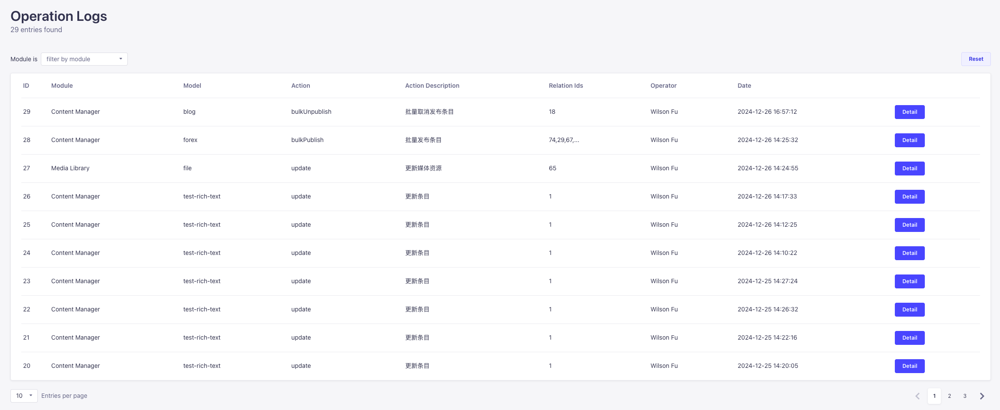
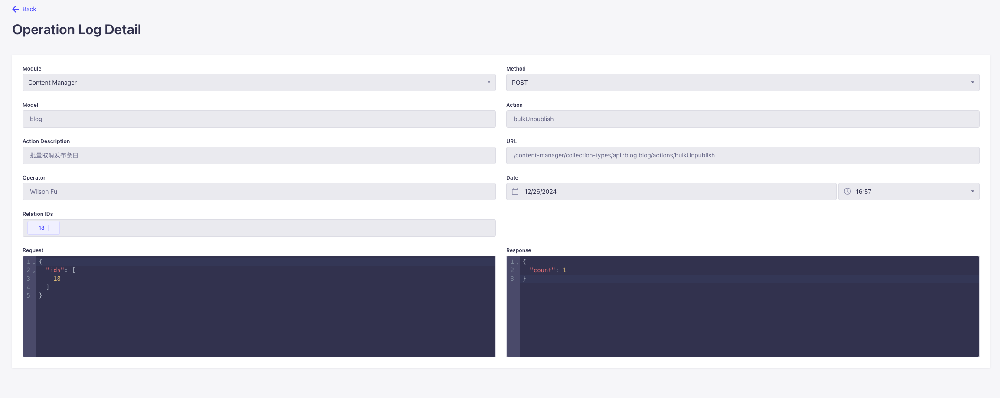

[//]: # (<p align="center">)

[//]: # (     )

[//]: # (</p>)

<h1 align="center">
  Strapi Plugin Operation Logs
</h1>

This plugin is used to help administrators record user operations on various modules of the Strapi management backend.

# Installation

`npm install strapi-plugin-operation-logs`

`yarn add strapi-plugin-operation-logs`


[//]: # (# Configuration)

[//]: # ()
[//]: # (The default depth can be customized via the plugin config. To do so create or edit you plugins.js file.)

[//]: # ()
[//]: # (## Config)

[//]: # ()
[//]: # (standard config add the following config to your config/plugins.js)

[//]: # ()
[//]: # (```)

[//]: # (module.exports = &#40;{ env }&#41; => &#40;{)

[//]: # (  'operation-logs': {)

[//]: # (    enabled: true,)

[//]: # (  },)

[//]: # (}&#41;;)

[//]: # (```)
# Usages

## List View Page

[//]: # (![list.png]&#40;https://github.com/SherlockTong/images/blob/main/strapi/v1.0.1/operation-log-list-view.png&#41;)


## Detail View Page




## 👍 Contribute

If you want to say **Thank You** and/or support the active development of `Strapi Plugin Operation Logs`, you can support us by:

1. Add a [GitHub Star](https://github.com/SherlockTong/strapi-plugin-operation-logs/stargazers) to the project.
2. Support the project by donating a [cup of coffee](https://ko-fi.com/sherlocktong).